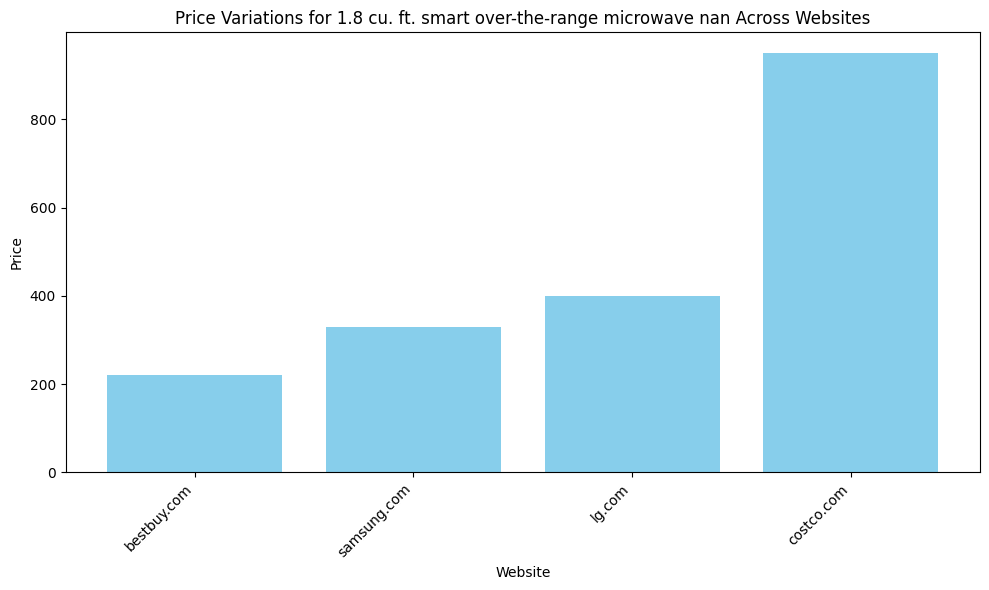
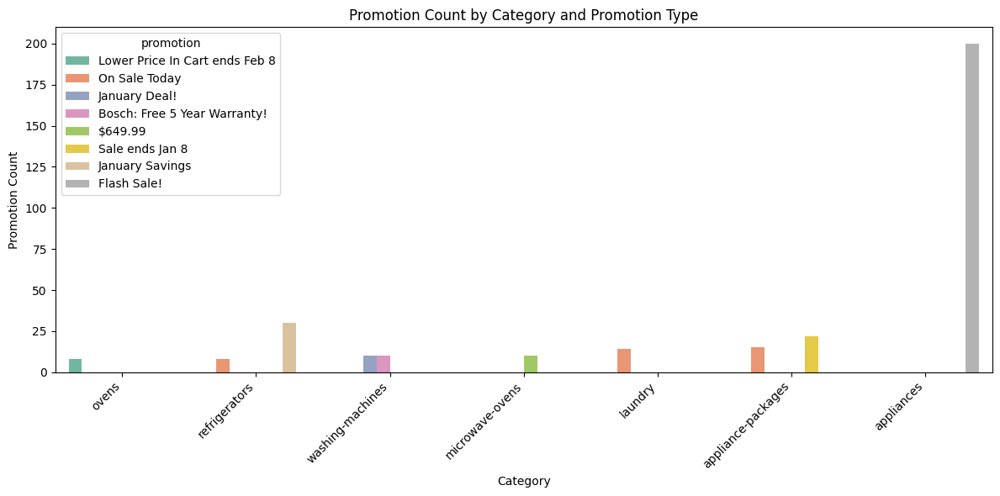
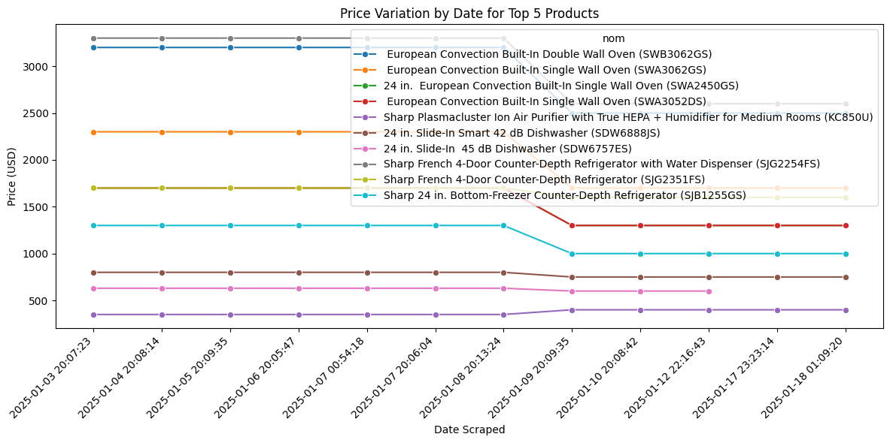
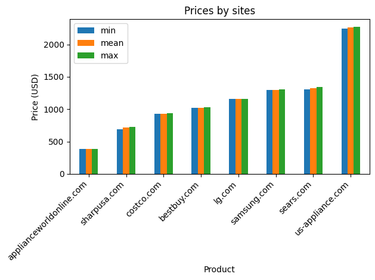

```python
import pandas as pd
import matplotlib.pyplot as plt
import re
from rapidfuzz import fuzz, process
import seaborn as sns
```

## Import libraries

Libraries


```python
# Function to normalize text
def normalize_text(text):
    if isinstance(text, str):
        text = text.lower()  # Convert to lowercase
        # nom = re.sub(r'[^a-z\s]', '', text)  # Uncomment if needed for special character removal
        return text
    else:
        # Convert non-string inputs to a string or handle them appropriately
        return str(text) if text is not None else ""
```


```python
# Function to find similar noms using RapidFuzz
def find_similar_noms(nom, nom_list, threshold=75):
    similar_noms = []
    for other_nom in nom_list:
        # Compute similarity score between nom and other nom
        score = fuzz.ratio(nom, other_nom)
        if score >= threshold:
            similar_noms.append((nom, other_nom, score))
    return similar_noms
```


```python
def get_top_product_price_variation(df):
    # Normalize product names
    df['normalized_nom'] = df['nom'].apply(normalize_text)
    df['normalized_description'] = df['description'].apply(normalize_text)
    
    df['nom_and_description'] = df['normalized_nom']+" "+df['normalized_description']
    
    # Apply fuzzy matching to group similar product names
    unique_noms = df['nom_and_description'].unique()
    nom_groups = {}

    for nom in unique_noms:
        group = find_similar_noms(nom, unique_noms)
        for _, other_nom, _ in group:
            nom_groups[other_nom] = nom  # Group similar product names

    # Map the grouped noms back to the DataFrame
    df['grouped_nom'] = df['nom_and_description'].map(lambda x: nom_groups.get(x, x))
    
    # Remove duplicates based on product name and website before counting occurrences
    df_unique = df.drop_duplicates(subset=['grouped_nom', 'website'])
    
    # Count the occurrences of each product by website
    product_counts = df_unique.groupby(["grouped_nom", "website"]).size().reset_index(name='count')
    
    # Find the product with the maximum count across all websites
    top_product = product_counts.groupby('grouped_nom').agg({'count': 'sum'}).idxmax().iloc[0]


    # Get the details of that top product across websites
    top_product_data = product_counts[product_counts['grouped_nom'] == top_product]
    
    # Extract price variations for that product across websites
    price_variations = df[df['grouped_nom'] == top_product].drop_duplicates(subset=['website'])[['website', 'prix']]

    return top_product, price_variations.sort_values(by='prix', ascending=True)


def plot_price_variations(price_variations, product_name):
    # Visualize price variations by website
    plt.figure(figsize=(10, 6))
    plt.bar(price_variations['website'], price_variations['prix'], color='skyblue')
    plt.title(f"Price Variations for {product_name} Across Websites")
    plt.xlabel('Website')
    plt.ylabel('Price')
    plt.xticks(rotation=45, ha="right")
    plt.tight_layout()
    plt.show()
```


```python
# Analyze data
def promotions_par_categorie(df):
    # Filter products on promotion
    promotion_df = df[df['promotion'] != ""]

    # Count promotions by category
    promotions_par_categorie = promotion_df.groupby(['category', 'promotion'])['promotion'].size().reset_index(name="count")

    # Sort by 'count' in descending order and get the top 5
    top_promotions = promotions_par_categorie.sort_values(by='count', ascending=False).head(10).sort_values(by='count', ascending=True)

    return top_promotions


def plot_promotions(promotions_par_categorie, title="Promotion Count by Category and Promotion Type", xlabel="Category", ylabel="Promotion Count"):
    # Create a Seaborn barplot for better visual representation
    plt.figure(figsize=(12, 6))
    sns.barplot(data=promotions_par_categorie, 
        x='category', 
        y='count', 
        hue='promotion', 
        palette="Set2")
    
    # Customize the plot
    plt.title(title)
    plt.xlabel(xlabel)
    plt.ylabel(ylabel)
    plt.xticks(rotation=45, ha="right")
    plt.tight_layout()
    plt.show()
```


```python
# Function to group by 'nom', 'website', and 'date_scraped', and sort by count
def group_by_nom_website_date(df):
    # Group by 'nom' and 'website' and calculate min, mean, max, and count of 'prix'
    avg_prices = df.groupby(["nom", "website"])["prix"].agg(["min", "mean", "max", "count"])

    # Filter out rows where the min price is equal to the max price
    grouped = avg_prices[avg_prices["min"] != avg_prices["max"]]

    # Sort by 'count' in descending order to get the top products
    grouped_sorted = grouped.sort_values(by='count', ascending=False)

    # Get the top 5 products with the most occurrences
    products_by_date = grouped_sorted.groupby('nom').head(1).sort_values(by='count', ascending=False).head(10)

    # Reset the index so 'nom' becomes a column again
    products_by_date = products_by_date.reset_index()

    return products_by_date


# Function to plot price variations by 'date_scraped' for the top 5 products
def plot_price_variations_by_date(df, products_by_date):
    # Filter the original dataframe to include only the top 5 products
    filtered_df = df[df['nom'].isin(products_by_date['nom'])]

    # Create the Seaborn plot showing price variation by date
    plt.figure(figsize=(12, 6))
    sns.lineplot(data=filtered_df, x='date_scraped', y='prix', hue='nom', marker='o')

    # Customize the plot
    plt.title("Price Variation by Date for Top 5 Products")
    plt.xlabel("Date Scraped")
    plt.ylabel("Price (USD)")
    plt.xticks(rotation=45, ha="right")
    plt.tight_layout()
    plt.show()
```


```python
# Analyze data
def analyze_data_in_same_site_grouped_sites(df, nom=None, website=None):
    # Group by 'nom' and 'website' to get the average prices and count
    avg_prices = df.groupby(["nom", "website"])["prix"].agg(["min", "mean", "max", "count"])

    # Filter out rows where min equals max
    avg_prices_filtered = avg_prices[avg_prices["min"] != avg_prices["max"]]

    # Group by 'website' and calculate mean of 'min', 'mean', and 'max'
    grouped_by_date = avg_prices.groupby(["website"]).agg({
        'mean': 'mean',
        'min': 'mean',
        'max': 'mean'
    }).reset_index()

    # Return the result sorted by 'min' in ascending order
    return grouped_by_date.sort_values(by='min', ascending=True)


# Plot data
def plot_data(avg_prices, nom="Average Prices by Product", xlabel="Product", ylabel="Price (USD)", x=None, y=None):
    # Ensure the DataFrame is indexed properly for plotting
    avg_prices = avg_prices.reset_index()  # Reset index for clean plotting
    
    # Plot the data
    avg_prices.plot(kind="bar", title=nom, xlabel=xlabel, ylabel=ylabel, x=x, y=y)
    
    # Adjust layout for better display
    plt.xticks(rotation=45, ha="right")
    plt.tight_layout()
    plt.show()
```


```python
# Main execution
if __name__ == "__main__":
    old_data = pd.read_csv("Electromenagerscleaned_data.csv")  # Read the existing data from the file
    # Concatenate the cleaned data to the old data
    df_cleaned = old_data

    # Analyze data and visualize
    # Get the top product and price variations
    top_product, price_variations = get_top_product_price_variation(df_cleaned)
    
    print(f"Top Product: {top_product}")
    print("Price variations by website:")
    print(price_variations)
    # Plot the price variations
    plot_price_variations(price_variations, top_product)
    
    
    print("\r\nAverage promotion par group:")
    print(promotions_par_categorie(df_cleaned))
    plot_promotions(promotions_par_categorie(df_cleaned), 
        title="Promotion Count by Category and Promotion Type", 
        xlabel="Category", 
        ylabel="Promotion Count")


    products_by_date = group_by_nom_website_date(df_cleaned)
    print("\r\nTop 5 Products by Occurrence:")
    print(products_by_date)
    # Plot price variations by date for the top 5 products
    plot_price_variations_by_date(df_cleaned, products_by_date)
    
    
    print("\r\nPrices by sites:")
    print(analyze_data_in_same_site_grouped_sites(df_cleaned))
    plot_data(analyze_data_in_same_site_grouped_sites(df_cleaned), "Prices by sites", "Product", "Price (USD)", "website", ["min", "mean", "max"])
```

    Top Product: 1.8 cu. ft. smart over-the-range microwave nan
    Price variations by website:
              website    prix
    86    bestbuy.com  219.99
    1052  samsung.com  329.00
    1078       lg.com  399.00
    174    costco.com  949.99
    


    

    


    
    Average promotion par group:
                  category                       promotion  count
    59               ovens  Lower Price In Cart ends Feb 8      8
    76       refrigerators                   On Sale Today      8
    90    washing-machines                   January Deal!     10
    89    washing-machines    Bosch: Free 5 Year Warranty!     10
    49     microwave-ovens                         $649.99     10
    33             laundry                   On Sale Today     14
    1   appliance-packages                   On Sale Today     15
    3   appliance-packages                 Sale ends Jan 8     22
    73       refrigerators                 January Savings     30
    4           appliances                     Flash Sale!    200
    


    

    


    Top 5 Products by Occurrence:
                                                     nom       website      min  \
    0  Sharp Plasmacluster Ion Air Purifier with True...  sharpusa.com   349.99   
    1   European Convection Built-In Single Wall Oven...  sharpusa.com  1299.99   
    2   European Convection Built-In Single Wall Oven...  sharpusa.com  1699.99   
    3  Sharp 24 in. Bottom-Freezer Counter-Depth Refr...  sharpusa.com   999.99   
    4  Sharp French 4-Door Counter-Depth Refrigerator...  sharpusa.com  1599.99   
    5  24 in.  European Convection Built-In Single Wa...  sharpusa.com  1299.99   
    6  Sharp French 4-Door Counter-Depth Refrigerator...  sharpusa.com  2599.99   
    7  24 in. Slide-In Smart 42 dB Dishwasher (SDW688...  sharpusa.com   749.99   
    8   European Convection Built-In Double Wall Oven...  sharpusa.com  2499.99   
    9      24 in. Slide-In  45 dB Dishwasher (SDW6757ES)  sharpusa.com   599.99   
    
              mean      max  count  
    0   370.823333   399.99     12  
    1  1533.323333  1699.99     12  
    2  2049.990000  2299.99     12  
    3  1174.990000  1299.99     12  
    4  1658.323333  1699.99     12  
    5  1533.323333  1699.99     12  
    6  3008.323333  3299.99     12  
    7   779.156667   799.99     12  
    8  2908.323333  3199.99     12  
    9   620.990000   629.99     10  
    


    

    


    
    Prices by sites:
                        website         mean          min          max
    0  applianceworldonline.com   384.196761   384.196761   384.196761
    6              sharpusa.com   713.060281   691.032211   728.716421
    2                costco.com   933.416244   930.455034   938.201678
    1               bestbuy.com  1023.385469  1020.142751  1028.388706
    3                    lg.com  1158.200000  1158.200000  1158.200000
    4               samsung.com  1300.458333  1294.625000  1303.375000
    5                 sears.com  1321.798105  1307.350596  1340.929614
    7          us-appliance.com  2259.777966  2243.622599  2275.933333
    


    

    

